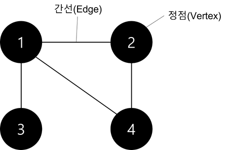
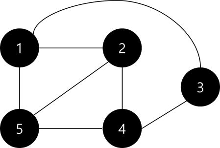
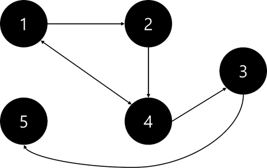
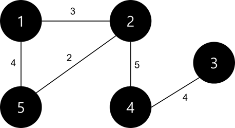
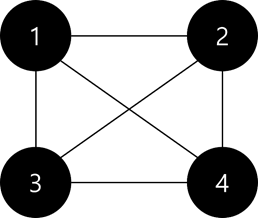

# 그래프

## 1. 정의

객체 사이의 연결 관계를 표현하는 자료구조로 정점과 간선으로 구성되어 있다.



## 2. 용어

- **정점(Vertex)**: 노드(Node)라고도 하며 데이터가 저장되는 그래프의 기본 원소이다.

위의 예시 그래프에서는 정점이 총 4개로 [1, 2, 3, 4]이다.

- **간선(Edge)**: 정점과 정점 사이에 있는 선으로 링크(Link)라고도 하며 정점 간의 관계를 의미한다.

위의 예시 그래프에서는 간선이 총 4개로 (1, 4), (1, 2), (1, 3), (2, 4)이다.

- **인접 정점(Adjacent Vertex)**: 간선에 의해 직접 연결된 정점으로 바로 옆에 있는 정점을 말한다.

위의 예시 그래프에서는 1의 인접 정점은 [2, 3, 4]이고, 2의 인접 정점은 [1, 4]이다.

- **차수(Degree)**: 하나의 정점에 연결된 간선의 수를 말한다. 방향 그래프에서는 다른 정점에서 들어오는 간선의 수를 진입 차수(In-Degree)와 다른 정점으로 나가는 간선의 수를 진출 차수(Out-Degree)라고 한다.

위의 예시 그래프에서 1의 차수는 3이고, 2의 차수는 2이다.

- **경로(Path)**: 정점에서 다른 정점을 가기 위해 거치는 정점을 나열하여 표시한다. (단, 거치는 정점과 정점사이에는 간선이 존재해야 한다.)

위의 예시 그래프에서 정점 3으로부터 정점 2로 가는 경로는 3 – 1 - 2이다.

- **사이클(Cycle)**: 다른 정점을 거쳐서 처음의 정점으로 돌아오는 경로를 사이클이라고 한다. 즉, 시작 정점과 종료 정점이 같은 경우를 말한다.

위의 예시 그래프에서는 경로 1 - 2 – 4 - 1을 사이클이라고 한다.

## 3. 종류

### **무방향 그래프(Undirected Graph)**

간선에 방향이 없는 그래프를 말한다. 그래서 정점과 정점 사이에 간선이 있다면 양 방향으로 이동이 가능하다.



### **방향 그래프(Directed Graph)**

간선에 방향이 있는 그래프를 말한다. 그래서 간선의 방향으로만 정점 사이의 이동이 가능하다.



### **가중치 그래프(Weighted Graph)**	

간선에 비용이 있는 그래프를 말한다. 그래서 정점과 정점 사이를 이동할 때마다 비용이 발생한다.



### **완전 그래프(Complete Graph)**

모든 정점이 간선으로 연결되어 있는 그래프이다.



## 4. 그래프 구현 방법

### **인접 행렬**

인접 행렬로 그래프를 표현할 때는 그래프의 연결 관계를 2차원 배열로 나타낸다.

정점 a에서 정점 b로 이동하는 간선이 존재하면 1(adj_list[a][b] = 1), 존재하지 않으면 0(adj_list[a][b] = 0)으로 표현을 한다.

**무방향 그래프**를 인접 행렬로 나타내면 아래와 같다. 무방향 그래프는 양방향을 가도 된다는 뜻을 말하므로 대각선(회색 칸)을 중심으로 대칭을 이룬다. 


**배열에서는 index가 0번째부터 시작하므로 모든 수에서 1을 뺀 값으로 행렬을 구성하였다. **

위의 무방향 그래프를 인접행렬로 나타내는 코드는 아래와 같다. 

```python
size = 5

vertex = [[0, 1], [0, 2], [0, 4], [1, 3], [1, 4], [2, 3], [3, 4]]
#vertex를 잇는 edge표시

adj_list = [[0 for _ in range(size)] for _ in range(size)]
#adj_list[5][5]인 배열 선언

for src, dst in vertex:
    adj_list[src][dst] = 1
    adj_list[dst][src] = 1
#양방향으로 이동 가능하도록 두 번 배열에 입력

print(adj_list)
```

0→1이 이동 가능하면 양방향이 가능하므로 adj_list[0][1] = 1, adj_list[1][0] = 1 로 나타난다. 

///////

**방향 그래프**를 인접 행렬로 나타내면 아래와 같다. 방향 그래프는 무방향 그래프와 다르게 방향이 정해져 있으므로 대각선(회색칸)을 기준으로 대칭을 이루지 않는다.


**배열에서는 index가 0번째부터 시작하므로 모든 수에서 1을 뺀 값으로 행렬을 구성하였다. **

위의 방향 그래프를 인접 행렬로 나타내는 코드는 아래와 같다. 

```python
size = 5

vertex = [[0, 1], [0, 3], [1, 3], [2, 0], [3, 0],[3, 2]]
#vertex를 잇는 edge표시

adj_list = [[0 for _ in range(size)] for _ in range(size)]
#adj_list[5][5]인 배열 선언

for src, dst in vertex:
    adj_list[src][dst] = 1
#한쪽 방향으로만 이동 가능하도록 한 번만 배열에 입력

print(adj_list)
```

0→1이 이동 가능하면 adj_list[0][1] = 1로 나타난다. 

/////////////

  

### **인접 리스트**

인접 리스트로 그래프를 표현할 때는 각각의 vertex에 연결된 vertex를 원소로 갖는 1차원 배열로 나타낸다.

정점 a에서 정점 b로 이동하는 간선이 존재하면 adj_list[a]에 b가 원소로 들어가 있고, 존재하지 않으면 adj_list[a]에 b가 원소로 들어가 있지 않다. 

**무방향 그래프**를 인접 리스트로 나타내면 아래와 같다. 


**배열에서는 index가 0번째부터 시작하므로 모든 수에서 1을 뺀 값으로 행렬을 구성하였다. **

vertex 2와 연결된 정점은 [1, 4, 5]이다. 이 정점의 정보가 adj_list[1]의 원소로 구성되어 있다.  

위의 방향 그래프를 인접 리스트로 나타내는 코드는 아래와 같다. 

```python
size = 5
vertex = [[0, 1], [0, 2], [0, 4], [1, 3], [1, 4], [2, 3], [3, 4]]
#vertex를 잇는 edge표시

adj_list = [[] for _ in range(size)]
#adj_list[5]인 배열 선언

for src, dst in vertex:
    adj_list[src].append(dst)
		adj_list[dst].append(src)
#양방향으로 이동 가능하도록 두 번 배열에 입력

print(adj_list)
```

**방향 그래프**를 인접 리스트로 나타내면 아래와 같다. 


**배열에서는 index가 0번째부터 시작하므로 모든 수에서 1을 뺀 값으로 행렬을 구성하였다. **

vertex 3(vertex 4에서 1을 뺀 값)와 연결된 정점은 [0, 2]이다. 이 정점이 adj_list[3]의 원소로 구성되어 있다.  

위의 무방향 그래프를 인접 리스트로 나타내는 코드는 아래와 같다. 

```python
size = 5
vertex = [[0, 1], [0, 3], [1, 3], [2, 0], [3, 0],[3, 2]]
#vertex를 잇는 edge표시

adj_list = [[] for _ in range(size)]
#adj_list[5]인 배열 선언

for src, dst in vertex:
    adj_list[src].append(dst)
#한쪽 방향으로만 이동 가능하도록 한 번만 배열에 입력

print(adj_list)
```